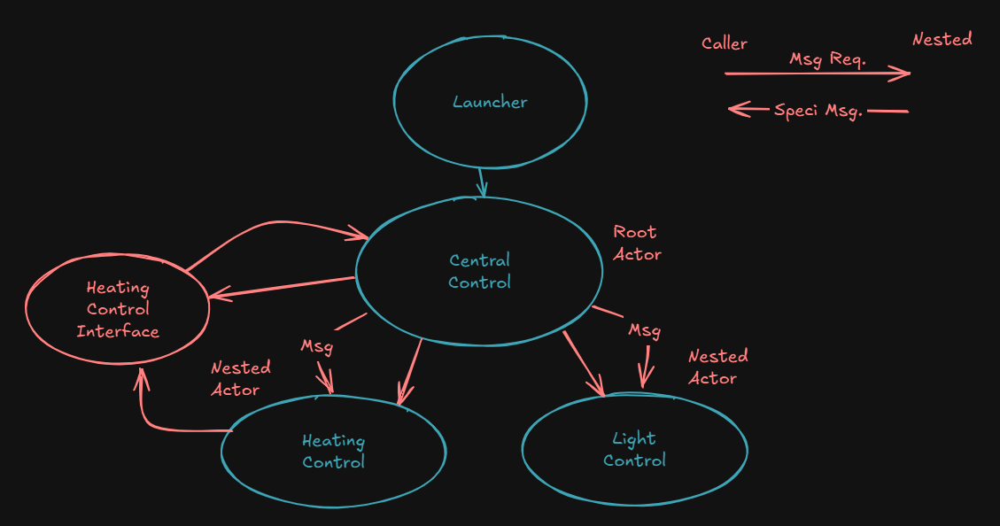

# LabVIEW Türkiye Community Actor Framework Event

This repository contains notes and example codes from the event organized by the LabVIEW Turkiye community, focusing on advanced topics of the Actor Framework architecture.

## 📅 Event Content

During the event, the following topics regarding hierarchy, communication, and interface management within the Actor Framework architecture were covered:

### 1. UI Actor Implementation
*   **Actor Core Override:** Details on how to implement Actors with a user interface (UI) by overriding the standard `Actor Core` method.

### 2. Actor Hierarchy
*   **Caller and Nested Actor:** The structure of the hierarchy between a Caller Actor and the Nested Actor running under it, along with the implementation of this structure.

### 3. Communication and Dependency Management
*   **Sending Messages:** Explaining how to send a message from a lower-level Nested Actor to an upper-level Calling Actor.
*   **Dependency Management:** Discussing how dependency management should be handled within the project while establishing communication.

## Examples:
- Session-1 / Actor Framework Intro.lvproj
- Session-2 / Stage1 / Chart Actor.lvproj
- Session-2 / Stage2 / Central Control System.lvproj

## Central Control System Diagram

